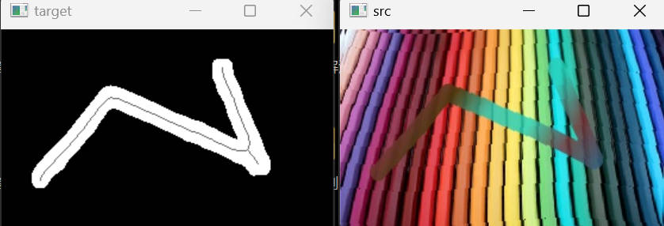

## 手势识别

例子是x东的

原图片 和 标注图片 分别保存在imgs/target和imgs/label

启动main.py 运行脚本训练

test.py 查看结果

使用EISeg工具去标注

https://blog.csdn.net/qq_37541097/article/details/120154543

 

欢迎加入星球哦
星球连接https://t.zsxq.com/06bIUvBEM